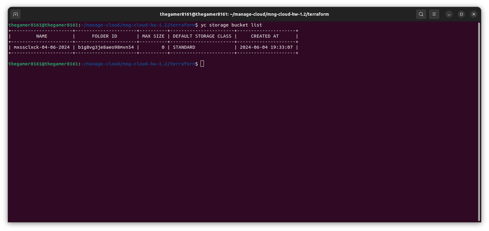
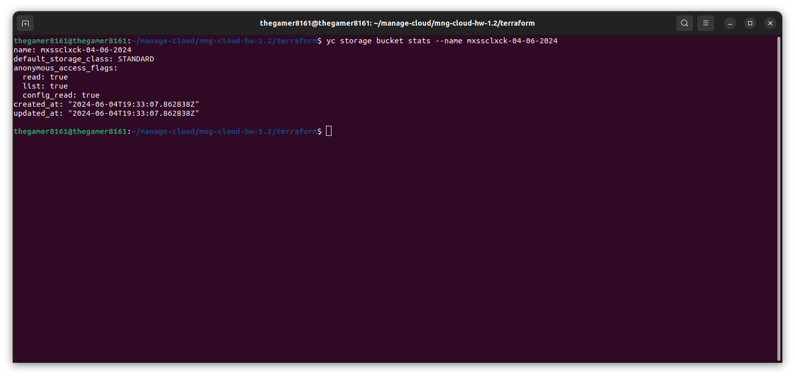
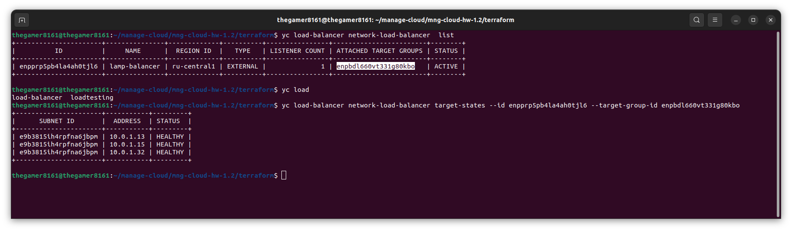
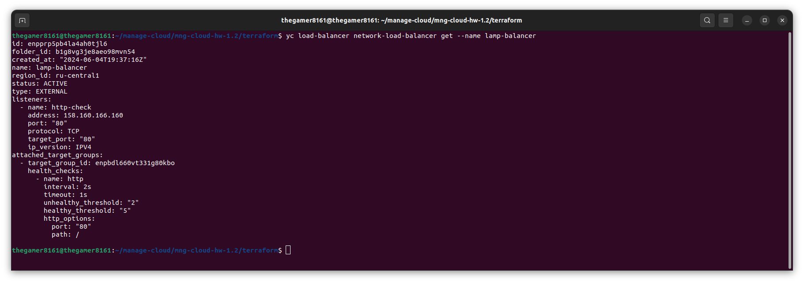
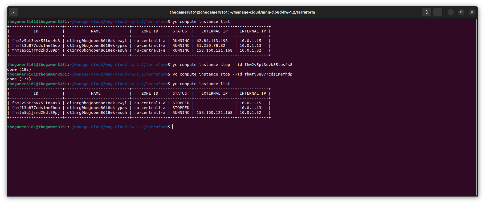
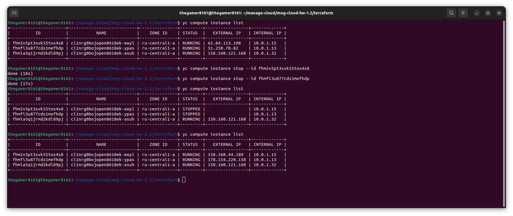
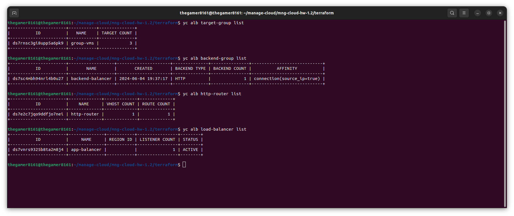
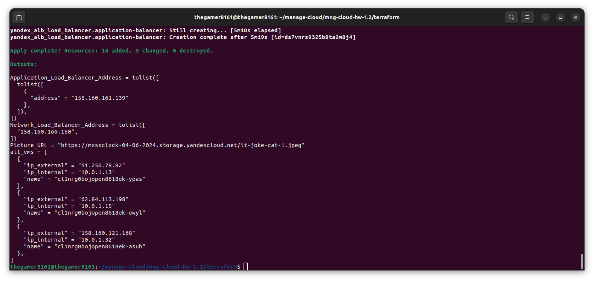

# Никоноров Денис - FOPS-8
# Домашнее задание к занятию «Вычислительные мощности. Балансировщики нагрузки»  

---

## Задание 1. Yandex Cloud 

**Что нужно сделать**

1. Создать бакет Object Storage и разместить в нём файл с картинкой:

 - Создать бакет в Object Storage с произвольным именем (например, _имя_студента_дата_).
 - Положить в бакет файл с картинкой.
 - Сделать файл доступным из интернета.
 
2. Создать группу ВМ в public подсети фиксированного размера с шаблоном LAMP и веб-страницей, содержащей ссылку на картинку из бакета:

 - Создать Instance Group с тремя ВМ и шаблоном LAMP. Для LAMP рекомендуется использовать `image_id = fd827b91d99psvq5fjit`.
 - Для создания стартовой веб-страницы рекомендуется использовать раздел `user_data` в [meta_data](https://cloud.yandex.ru/docs/compute/concepts/vm-metadata).
 - Разместить в стартовой веб-странице шаблонной ВМ ссылку на картинку из бакета.
 - Настроить проверку состояния ВМ.
 
3. Подключить группу к сетевому балансировщику:

 - Создать сетевой балансировщик.
 - Проверить работоспособность, удалив одну или несколько ВМ.
4. (дополнительно)* Создать Application Load Balancer с использованием Instance group и проверкой состояния.

---

## Выполнение задания 1. Yandex Cloud

Создан бакет в Object Strorage c моим ником от git репозитория `mxssclxck` - [git link](https://github.com/mxssclxck/)

```terraform

// Создаем сервисный аккаунт для backet
resource "yandex_iam_service_account" "service" {
  folder_id = var.folder_id
  name      = "bucket-sa"
}

// Назначение роли сервисному аккаунту
resource "yandex_resourcemanager_folder_iam_member" "bucket-editor" {
  folder_id = var.folder_id
  role      = "storage.editor"
  member    = "serviceAccount:${yandex_iam_service_account.service.id}"
  depends_on = [yandex_iam_service_account.service]
}

// Создание статического ключа доступа
resource "yandex_iam_service_account_static_access_key" "sa-static-key" {
  service_account_id = yandex_iam_service_account.service.id
  description        = "static access key for object storage"
}

// Создание бакета с использованием ключа
resource "yandex_storage_bucket" "mxssclxck" {
  access_key = yandex_iam_service_account_static_access_key.sa-static-key.access_key
  secret_key = yandex_iam_service_account_static_access_key.sa-static-key.secret_key
  bucket = local.bucket_name
  acl    = "public-read"
}

```

В названии бакета отвечает локальная переменная current_timestamp в формате "day-month-year":

```terraform

locals {
    current_timestamp = timestamp()
    formatted_date = formatdate("DD-MM-YYYY", local.current_timestamp)
    bucket_name = "mxssclxck-${local.formatted_date}"
}

```

Код Terraform для создания бакета в файле [bucket.tf](/terraform/bucket.tf)

Загрузка в бакет файл с картинкой:

```terraform

resource "yandex_storage_object" "it-joke-cat-1" {
  access_key = yandex_iam_service_account_static_access_key.sa-static-key.access_key
  secret_key = yandex_iam_service_account_static_access_key.sa-static-key.secret_key
  bucket = local.bucket_name
  key    = "it-joke-cat-1.jpeg"
  source = "~/manage-cloud/mng-cloud-hw-1.2/img/it-joke-cat-1.jpeg"
  acl = "public-read"
  depends_on = [yandex_storage_bucket.mxssclxck]
}

```

Источником картинки будет файл, лежащий в директории `img`, за публичность картинки будет отвечать параметр `acl = "public-read"`.

Код Terraform для загрузки картинки в файле [upload_image.tf](/terraform/upload_image.tf)

Проверка созданного бакета:





Бакет создан и работает

Создана группа VM в public подсети фиксированного размера с шаблоном LAMP (Linux Apache MySQL PHP) и веб-страницей, содержащей ссылку на картинку из бакета.

Код отвечающий за сеть и подсеть public:

```terraform

variable "default_cidr" {
  type        = list(string)
  default     = ["10.0.1.0/24"]
  description = "https://cloud.yandex.ru/docs/vpc/operations/subnet-create"
}

variable "vpc_name" {
  type        = string
  default     = "develop"
  description = "VPC network&subnet name"
}

variable "public_subnet" {
  type        = string
  default     = "public-subnet"
  description = "subnet name"
}

```

```terraform

locals {
  ssh-keys = file("~/manage-cloud/mng-cloud-hw-1.2/yc-ssh-key/yc-hw-nat.pub")
  ssh-private-keys = file("~/manage-cloud/mng-cloud-hw-1.2/yc-ssh-key/yc-hw-nat")
}

resource "yandex_vpc_network" "develop" {
  name = var.vpc_name
}
resource "yandex_vpc_subnet" "public" {
  name           = var.public_subnet
  zone           = var.default_zone
  network_id     = yandex_vpc_network.develop.id
  v4_cidr_blocks = var.default_cidr
}

```
За создание стартовой веб-страницы будет отвечать параметр user_data в разделе metadata:

```terraform

metadata = {
    ssh-keys = "ubuntu:${local.ssh-keys}"
    serial-port-enable = "1"
    user-data  = <<EOF
#!/bin/bash
cd /var/www/html
echo '<html><head><meta charset="utf-8"><title>IT meme time</title></head><body><h1>Минутка IT-мемов</h1></body></html>' > index.html
EOF

```

Проверка состояния виртуальной машины будет отвечать код:

```terraform

health_check {
    interval = 30
    timeout  = 10
    tcp_options {
      port = 80
    }
  }

```

Проверка здоровья будет выполнятся каждые 30 сек и будет считаться успешной, если подключение к порту 80 ВМ происходит успешно в течении 10 сек.

Код Terraform [main.tf](/terraform/main.tf), [variables.tf](/terraform/variables.tf), [group_vm.tf](/terraform/group_vm.tf)

После применения кода развернуты 3 ВМ по шаблону LAMP:


Создан сетевой балансировщик и подключена группа ВМ:

```terraform

resource "yandex_lb_network_load_balancer" "network-balancer" {
  name = "lamp-balancer"
  deletion_protection = "false"
  listener {
    name = "http-check"
    port = 80
    external_address_spec {
      ip_version = "ipv4"
    }
  }
  attached_target_group {
    target_group_id = yandex_compute_instance_group.group-vms.load_balancer[0].target_group_id
    healthcheck {
      name = "http"
      interval = 2
      timeout = 1
      unhealthy_threshold = 2
      healthy_threshold = 5
      http_options {
        port = 80
        path = "/"
      }
    }
  }
}

```

Балансировщик будет проверять доступность порта 80 и путь "/" при обращении к группе ВМ. Проверка выполняется с интервалом 2 сек, с таймаутом 1 сек. для определения состояния сервера: 2 неудачные проверки для перевода сервера LAMP в недоступное состоянии и 5 успешных проверок для возврата в доступное состояние.

Проверка статуса балансировщка и подключенной к нему группе ВМ:



Балансировщик создан и активен, подключение к нему ВМ в статусе "HEALTHY".

Проверка доступности сайта получив внешний ip:



Вбиваем ip в браузере и видим страницу 


Все работает!

Теперь отключим 2 ВМ для проверки доступности сайта после отключения ВМ.



Сайт работает и доступен. Балансировщик переключился на доступную.

Через некоторое время, сработал Healthcheck, выключенные ВМ были снова запущены.



Код Terraform [network_loadbalancer.tf](/terraform/network_loadbalancer.tf)

Создан App Load Balancer с использованием Instance group + проверка состояния.

```terraform

resource "yandex_alb_target_group" "alb-group" {
  name           = "group-vms"

  target {
    subnet_id    = yandex_vpc_subnet.public.id
    ip_address   = yandex_compute_instance_group.group-vms.instances.0.network_interface.0.ip_address
  }

  target {
    subnet_id    = yandex_vpc_subnet.public.id
    ip_address   = yandex_compute_instance_group.group-vms.instances.1.network_interface.0.ip_address
  }

  target {
    subnet_id    = yandex_vpc_subnet.public.id
    ip_address   = yandex_compute_instance_group.group-vms.instances.2.network_interface.0.ip_address
  }
  depends_on = [
    yandex_compute_instance_group.group-vms
]
}

```

Создана группа Backend'ов.

```terraform

resource "yandex_alb_backend_group" "backend-group" {
  name                     = "backend-balancer"
  session_affinity {
    connection {
      source_ip = true
    }
  }

  http_backend {
    name                   = "http-backend"
    weight                 = 1
    port                   = 80
    target_group_ids       = [yandex_alb_target_group.alb-group.id]
    load_balancing_config {
      panic_threshold      = 90
    }    
    healthcheck {
      timeout              = "10s"
      interval             = "2s"
      healthy_threshold    = 10
      unhealthy_threshold  = 15 
      http_healthcheck {
        path               = "/"
      }
    }
  }
depends_on = [
    yandex_alb_target_group.alb-group
]
}

```

Создан HTTP-router для HTTP-трафика и виртуальный хост:

```terraform

resource "yandex_alb_http_router" "http-router" {
  name          = "http-router"
  labels        = {
    tf-label    = "tf-label-value"
    empty-label = ""
  }
}

resource "yandex_alb_virtual_host" "my-virtual-host" {
  name                    = "virtual-host"
  http_router_id          = yandex_alb_http_router.http-router.id
  route {
    name                  = "route-http"
    http_route {
      http_route_action {
        backend_group_id  = yandex_alb_backend_group.backend-group.id
        timeout           = "60s"
      }
    }
  }
depends_on = [
    yandex_alb_backend_group.backend-group
]
}

```

Создан L7-балансировщик:

```terraform

resource "yandex_alb_load_balancer" "application-balancer" {
  name        = "app-balancer"
  network_id  = yandex_vpc_network.develop.id

  allocation_policy {
    location {
      zone_id   = var.default_zone
      subnet_id = yandex_vpc_subnet.public.id
    }
  }

  listener {
    name = "listener"
    endpoint {
      address {
        external_ipv4_address {
        }
      }
      ports = [ 80 ]
    }
    http {
      handler {
        http_router_id = yandex_alb_http_router.http-router.id
      }
    }
  }

 depends_on = [
    yandex_alb_http_router.http-router
] 
}

```

Проверим созданные ресурсы 



Все работает и проверяем по IP App Load Balancer


Сайт открывается, App Load Balancer работает.

Output Terraform:

